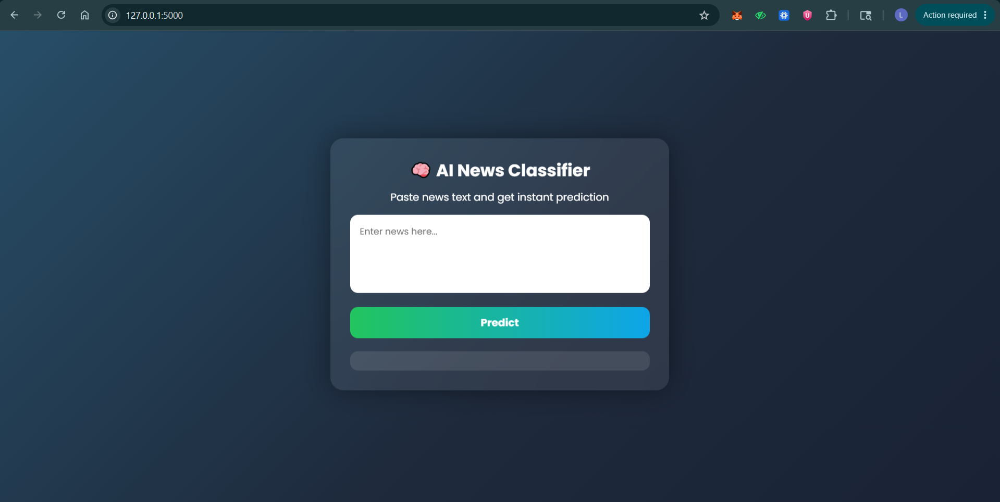
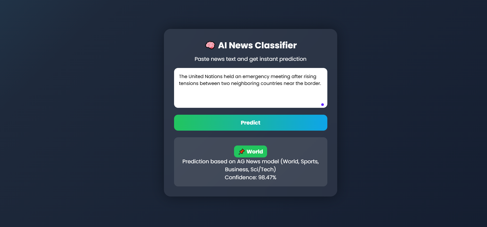
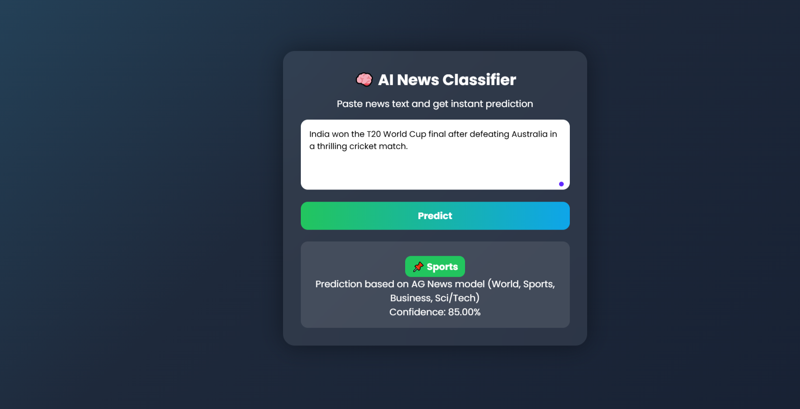
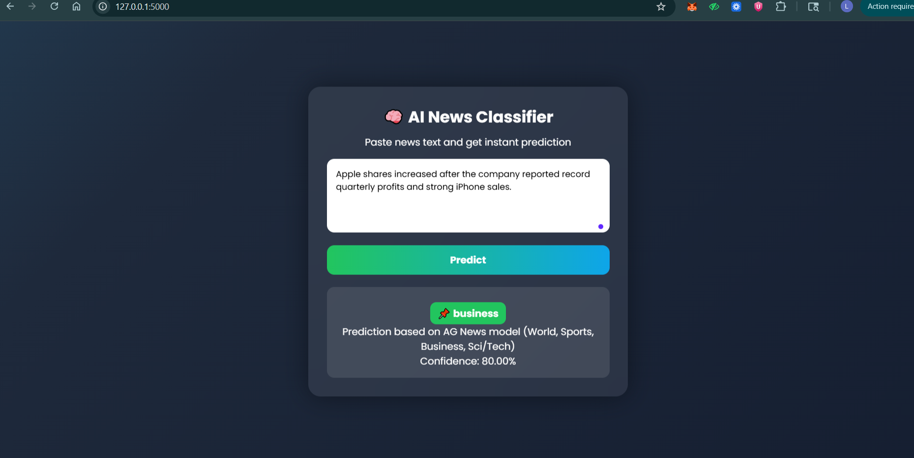
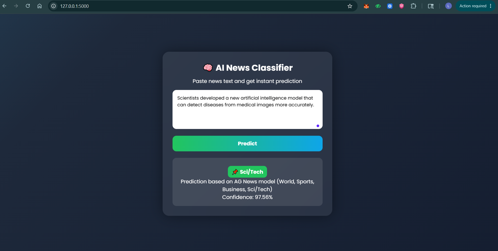
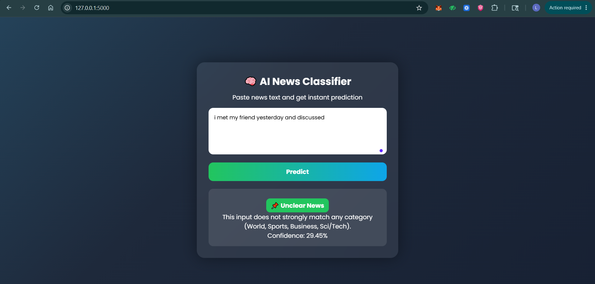

# 📰 AI-Powered News Classification System (DistilBERT + Flask)


This project is an AI-based news classification web application built using HuggingFace Transformers (DistilBERT) and Flask.  
It classifies news articles into multiple categories with confidence scoring and handles uncertain inputs using threshold-based logic.

---

## 🚀 Features

- AI-based news classification using DistilBERT  
- Categories: World, Sports, Business, Sci/Tech  
- Confidence threshold for uncertain predictions  
- Rule-based enhancement for Sports detection  
- Keyword-based improvement for Business detection  
- Flask web interface (frontend + API)  
- Automatic model loading from external storage (Google Drive)  

---

## 📂 Project Structure

```text
news-classifier/
├── app.py
├── requirements.txt
├── Procfile
├── .gitignore
└── templates/
    └── index.html
│── best_distilbert_news_model/ (not included in GitHub)

```
## ⚙️ Installation & Setup

## 1. Clone Repository

## ⚙️ Installation & Setup

### 1. Clone Repository
```bash
git clone [https://github.com/LakshKumar12345/news-classifierr.git](https://github.com/LakshKumar12345/news-classifierr.git)
cd news-classifierr
```


### 2. Create Virtual Environment (optional)
```
python -m venv venv

# Windows:
venv\Scripts\activate

# Mac/Linux:
source venv/bin/activate
---
```
### 3. Install Dependencies
pip install -r requirements.txt

---

### 4. Run Application
python app.py

---
> ℹ️ **Note:** When you run `app.py` for the first time, the application will automatically download the fine-tuned DistilBERT model (`best_distilbert_news_model`) from Google Drive. This process may take a few minutes depending on your internet connection, so please be patient! ☕
### 5. Open in Browser
http://127.0.0.1:5000

---

## 🧠 Model Information

- Model: DistilBERT (fine-tuned for news classification)
- Input: Raw news text
- Output: Predicted category + confidence score

---

## 📸 Screenshots














---

## 🏗️ Tech Stack

- Python  
- Flask  
- HuggingFace Transformers  
- PyTorch  
- Google Drive (model storage)  

---

## 🚀 Future Improvements

- Improve model accuracy with fine-tuning  
- Add more categories  
- Deploy on cloud platform  
- Improve UI/UX design  

---

## 👨‍💻 Author
```
Laksh Kumar
Machine learning Intern
Developers Hub Cooperation
```
